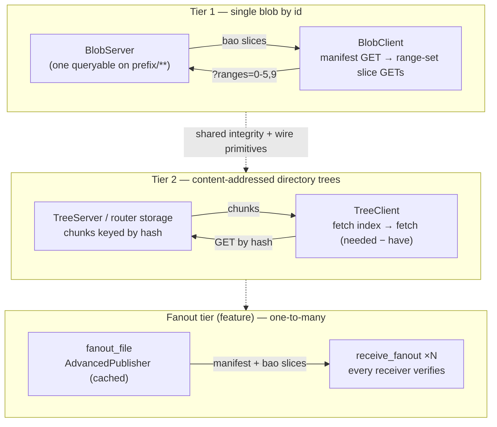
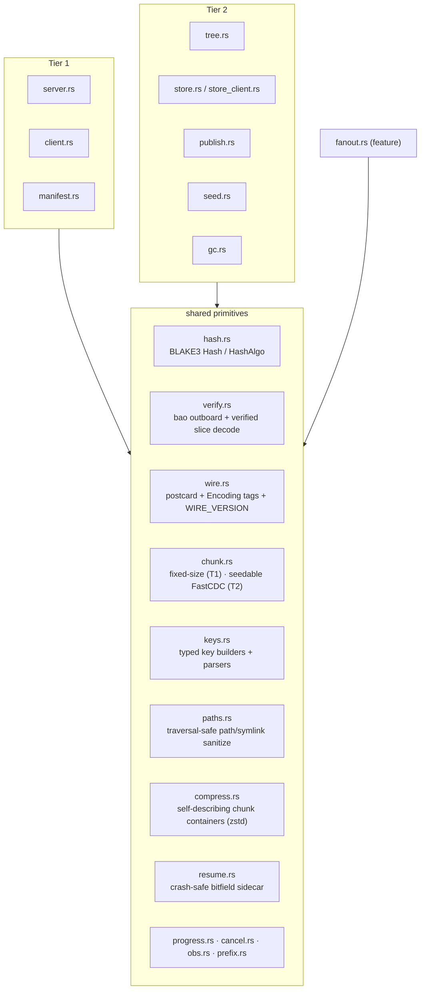

# Architecture

`zblob` moves large payloads over [Zenoh](https://zenoh.io) with integrity,
progress, and resume. This document is the map: the three transfer tiers, the
primitives they share, and the handful of invariants the whole design leans
on. For the *why* behind the integrity core see
[integrity-model.md](integrity-model.md); for the keyspace and the wire see
[wire-protocol.md](wire-protocol.md); for the decisions that were taken and
rejected see [design-decisions.md](design-decisions.md).

## The one idea everything rests on

A payload's identity is its **BLAKE3 bao root**. Every chunk travels as a *bao
slice* — the bytes plus the parent hashes proving them against that root — so
each Zenoh reply is verifiable on its own, out of order, at 16 KiB
granularity, given only `(root, total_len, chunk range)`. There is no
end-of-transfer hash pass; a tampered reply is dropped alone and re-fetched,
and a partial download is always a proven-correct partial. Pin the root and a
server cannot substitute content at all. Everything below is transport and
bookkeeping around that fact.

## Three tiers



**Tier 1 — a single blob, addressed by id.** One `BlobServer` queryable serves
every blob under a key prefix. A download is a manifest GET, then range-set
slice GETs (`?ranges=0-5,9,12-20`); the client persists a chunk bitfield next
to the `.part` file and re-queries exactly its holes, so resume, retry, and
arbitrary-hole fetch are one code path. Memory is `O(chunk_size)` regardless
of blob size or arrival order. Tier 1 also carries verified **push** (uploads
gated by a `PushPolicy`), `…/have` **availability** bitfields, cooperative
**replicated** servers, and a filesystem-free path both ways
(`download_to_writer`, `upload_source`).

**Tier 2 — content-addressed directory trees** (the casync model). A snapshot
is a `TreeIndex` (a depth-first entry list; files reference their chunks by
BLAKE3 hash, with the FastCDC parameters recorded in the index) plus a
content-addressed `ContentStore` keyed `<prefix>/blake3/<hex>`. `root_hash` is
a canonical versioned postcard digest with mtime excluded, so byte-identical
trees hash identically. The client validates the index fully — paths, sizes,
root recomputation, optional pinning — *before* fetching the chunks it is
missing (`needed − have`, concurrently) and materializing defensively:
sanitized paths, symlinks last with confined targets, canonical-parent checks,
directory modes and mtimes restored last. Progress *is* "which hashes are on
disk", so an interrupted pull resumes for free and identical chunks transfer
once.

**Fanout tier** (feature `fanout`) — one-to-many rollout over a `zenoh-ext`
`AdvancedPublisher`: a cached bao-slice sample stream that late joiners replay
and every receiver verifies against the pinned root exactly as a downloader
does. No resume — an interrupted receiver starts over.

## Shared primitives

The tiers are thin; the substance is in primitives they share. A slice
verified by tier 1 and a chunk verified by tier 2 go through the same integrity
core.



- **`hash.rs`** — a BLAKE3-only `Hash` and the `HashAlgo` tag that names it on
  the wire.
- **`verify.rs`** — the integrity core: bao outboard construction (in memory,
  or a sibling `.obao4` file for huge blobs) and verified slice encode/decode.
  Three sizes are in play: a *bao chunk* is 1 KiB (the BLAKE3 leaf), a *group*
  is 16 KiB (the verification granularity), a *transfer chunk* is a multiple of
  16 KiB (the wire unit).
- **`wire.rs`** — postcard framing, `Encoding` tags, and `WIRE_VERSION` carried
  as every control struct's first field.
- **`chunk.rs`** — `TransferChunks` fixed-size arithmetic for tier 1;
  `CdcParams` seedable FastCDC for tier 2.
- **`keys.rs`** — every key expression and its parser, typed and built here
  rather than with `format!` (a mismatched reply key is silently dropped).
- **`paths.rs`**, **`compress.rs`**, **`resume.rs`**, plus `progress.rs`,
  `cancel.rs`, `obs.rs`, and the role-typed `prefix.rs`.

## A tier-1 download, end to end

```mermaid
sequenceDiagram
    participant C as BlobClient
    participant S as BlobServer
    C->>S: GET the manifest key
    S-->>C: Manifest (root, total_len, chunk_size)
    Note over C: validate; derive holes from the .part bitfield
    loop until no holes (resume == retry)
        C->>S: GET the range-set selector for its holes
        S-->>C: one bao slice per index (own key, ENC_SLICE)
        Note over C: verify each slice vs the pinned root,<br/>before writing the .part
    end
    Note over C: bitfield full, rename .part to dest
```

Verification happens before the byte touches the `.part`, so a hostile or
stale responder can never advance the download with wrong bytes — it is simply
skipped, and an honest replica's reply for the same hole is accepted. That
"any peer can answer, unacceptable replies are skipped not fatal" property is
what lets several servers share one prefix.

## Invariants the design relies on

These are not style preferences; break one and transfers fail in ways that are
hard to see. They are stated here and enforced in code and tests.

- **Backpressure is automatic.** `Session::get` defaults to
  `CongestionControl::Block` and replies inherit it, so chunk replies block
  rather than drop under load. The crate sets *no* congestion control on
  queries and does not enable Zenoh's `internal` feature. (Publications default
  to `Drop`, so the fanout tier sets `Block` explicitly.) Reply *consolidation*
  is a separate knob: clients set `ConsolidationMode::None` so replies stream.
- **Reply keys must match the query.** Clients GET the `<prefix>/<id>/**`
  wildcard or the `slice/<i>` replies are silently rejected
  (`ReplyKeyExpr::MatchingQuery`); `keys::slice_selector` makes that
  impossible. Servers reply on *their own* key, not `query.key_expr()`, so a
  wildcard-origin query gets attributable, cacheable answers.
- **Any peer can answer.** A bad decode, a failed validation, a wrong id, or a
  wrong pinned root is skipped, never fatal — one hostile or stale responder
  must not deny a fetch an honest replica can serve.
- **Untrusted input is bounded and validated, never clamped.** Manifest and
  index sizes, chunk geometry, entry paths, symlink targets, and allocation
  counts all have caps that reject rather than silently trim.

## Where to run it

The default tier-2 model runs a `TreeServer` inside the producer. Pointing the
store at a **router-hosted Zenoh storage** instead makes transfers serverless
(the producer PUTs and exits), dedups fleet-wide, and survives producer
restarts — see [router-storage.md](router-storage.md). Migrating a consumer
from wire v2 to v3 is [migration-v3.md](MIGRATION-v3.md).
