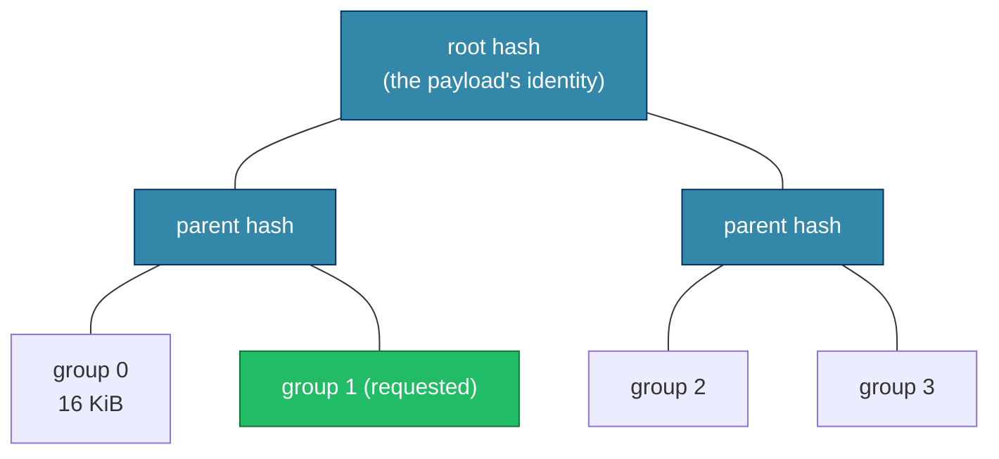

# The integrity model: BLAKE3 + bao verified streaming

This is the core `zblob` builds everything else on. If you read one design
paper, read this one — the tiers, the resume story, the "any peer can answer"
property, and the availability semantics all fall out of it.

## The claim

A payload's identity is its **BLAKE3 bao root**: a single 32-byte hash. Every
transfer chunk travels as a *bao slice* — the chunk's bytes plus the
parent-hash pairs needed to verify them against that root. So every Zenoh reply
is **independently verifiable given only `(root, total_len, chunk range)`**,
with no other state, in any order.

That one property is what the rest of the crate needs:

- **Out-of-order delivery.** Zenoh replies arrive in no guaranteed order. Each
  slice self-proves, so the client writes each into its final position as it
  lands — no reassembly buffer, no ordering constraint.
- **No end-of-transfer hash pass.** Integrity is checked per slice, before the
  bytes touch the `.part` file. A finished download is already verified; there
  is nothing left to do.
- **Tampering is localized.** A corrupt or hostile slice fails its own
  verification and is dropped alone, then re-fetched. It cannot poison
  neighbouring chunks or the whole download.
- **A partial download is a proven-correct partial.** Every byte on disk was
  verified against the root, so an interrupted transfer resumes from trustworthy
  state rather than re-validating.

Pin the root (`DownloadRequest::pinned`) and a server cannot substitute content
at all: a slice that does not verify against *your* root is unacceptable, no
matter who sent it.

## How a slice proves itself

BLAKE3 is itself a Merkle tree over 1 KiB leaves. [bao] is the format that
serializes the interior hashes so a *range* of leaves can be verified against
the root without the whole tree. `zblob` computes the tree at a **16 KiB block
size** (`BAO_BLOCK`): the verification group is 16 KiB, giving ~0.4% outboard
overhead (and no outboard at all for payloads ≤ 16 KiB).

[bao]: https://github.com/oconnor663/bao

Three sizes are in play — keep them distinct:

| unit | size | role |
|---|---|---|
| bao chunk (`ChunkNum`) | 1024 B | the BLAKE3 leaf |
| group (`BAO_BLOCK`) | 16 KiB = 2⁴ bao chunks | the verification granularity |
| transfer chunk (`chunk.rs`) | a multiple of 16 KiB | the wire unit a reply carries |

A slice for group 1 carries **group 1's bytes** plus **the sibling hashes on
the path to the root** (group 0's hash, and `P1`). The client recomputes
group 1's hash from the bytes, combines it with the siblings up the tree, and
checks the result equals the pinned root. Wrong bytes, a wrong sibling, or a
slice replayed at a different index all fail this check — which is exactly the
adversarial-suite oracle (`tests/hostile_peer.rs`): *succeed with exactly the
right bytes, or fail cleanly.*

The server builds the tree once, at registration, by streaming the source
through BLAKE3 into an **outboard** (the parent-hash tree). It keeps the
outboard in memory, or spills it to a sibling `.obao4` file for very large
blobs, so serving reads only the requested byte ranges. Because the manifest is
*derived* from that same pass, a served manifest can never disagree with the
bytes, and a crafted manifest can never steer the serving path into a panic.

## Two consequences worth stating outright

**Any peer can answer, and a bad one is harmless.** Since acceptability is a
local property of `(reply, pinned root)`, the client does not trust a
responder — it trusts the proof. A wrong id, a failed decode, a wrong root:
skipped, never fatal. This is what lets several servers share one prefix and a
download survive a hostile or stale replica as long as one honest replica
answers. Every `fetch_*` loop preserves it.

**Tier-1 availability is all-or-nothing — by construction, not by omission.** A
bao slice carries the sibling hashes proving it to the root, and computing
those requires the *whole* blob. So a holder with only part of a blob can serve
no verified slice of it at all. A server's `…/have` bitfield is therefore
always "all" or "none" for tier 1; there is no honest partial answer, and
advertising an in-flight push's resume bitfield as availability would be a lie
(the receiver could not actually serve those chunks). Partial possession is a
real, useful thing — but it lives on **tier 2**, where a chunk is
self-identifying by its own hash and can be held and served independently. That
is what `StoreClient::probe` reports.

## Why tier 2 is the same idea, moved down a level

Tier 2 addresses each *chunk* by its own BLAKE3 hash (`<prefix>/blake3/<hex>`),
so a chunk is verifiable in isolation: fetch it, hash it, done. The `TreeIndex`
binds those chunk hashes into files and directories, and its `root_hash` is a
canonical versioned postcard digest (mtime excluded) — so byte-identical trees
hash identically, and the client validates the entire index (paths, sizes, root
recomputation, optional pinning) *before* fetching a single chunk. Same
principle as tier 1 — verify against a pinned root before trusting bytes —
applied at chunk granularity instead of slice granularity, which is precisely
why tier 2 *can* express partial possession where tier 1 cannot.

See [wire-protocol.md](wire-protocol.md) for how these slices and chunks are
addressed and framed on the wire, and [design-decisions.md](design-decisions.md)
for why BLAKE3/bao was chosen over the alternatives.
