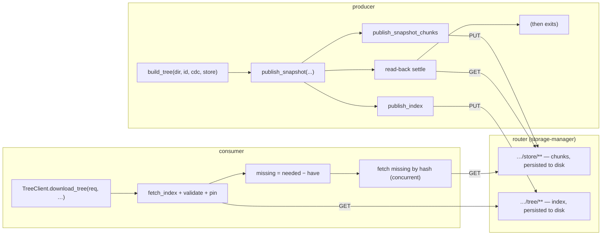

# Router-hosted Tier-2 chunk store

How to run a Zenoh **router** as the fleet-wide content store for `zblob`
Tier-2 directory sync. Background: the [2026-07 analysis &
redesign](analysis-2026-07.md) and the crate docs (`cargo doc`).

## Why

Tier-2's default model runs a `TreeServer` inside the producer: the producer
must stay alive for the whole transfer, each producer serves its own copy of
every chunk, and identical chunks across producers are transferred more than
once.

Pointing the store at a **router-hosted Zenoh storage** instead removes all three
limits:

- **Serverless transfers.** A producer PUTs its chunks + tree index into the
  storage and *exits*. The storage keeps serving them — no long-lived server.
- **Fleet-wide dedup.** A chunk key is its content hash, so a chunk PUT by *any*
  producer is reused by *every* consumer (and every other producer). Common files
  across hosts/versions move once.
- **Survives producer restart.** The bytes live on the router (on disk, with the
  filesystem backend), independent of any producer's lifetime.

Because chunk keys are **immutable** (`<prefix>/blake3/<hash>` only ever maps to
one byte string), the storage's last-writer-wins reconciliation is a no-op and
re-publishing is idempotent.

`publish_snapshot` ends with a **read-back settle phase** — it GETs the index
and, per `SettleCoverage`, either a bounded sample of chunk keys or all of them,
until the storage answers (or the settle budget expires).

Be precise about what that buys. `SettleCoverage::All` means *a client can fetch
this now*. `SettleCoverage::Sample(n)` is a smoke test — it establishes that the
storage received something, and says nothing about the chunks it did not probe.
A producer that is about to exit should use `All`. And note that **any**
responder satisfies a probe, so a `TreeServer` still running on the same prefix
makes the phase report success without a storage having retained anything —
easy to arrange accidentally while developing.

## How it fits together



`zblob` provides the producer side:

- `publish_chunk` — PUT one content-addressed chunk.
- `publish_snapshot_chunks` — PUT the chunks one snapshot references.
- `publish_store` — PUT *every* chunk in a store. This mirrors a whole content
  store to a router, which is occasionally what you want and is usually not:
  a producer's store holds other snapshots' chunks too.
- `publish_index` — PUT an encoded `TreeIndex`.
- `publish_snapshot` — the snapshot's chunks, its index, then read-back
  settling.

The consumer side is **unchanged**: `TreeClient::download_tree` issues ordinary
GETs, which the storage answers exactly as a `TreeServer` would. Producer and
consumer only have to agree on the `store_prefix` and `tree_prefix`.

## Running it

```bash
zenohd -c router-blob-storage.json5
```

The essentials of the config:

- Requires the `zenoh-plugin-storage-manager` + filesystem backend
  (`zenoh-backend-fs`) plugins, shipped with a standard `zenohd`.
- Declares two storages — one on the **chunk** key range (`…/store/**`) and one
  on the **index** key range (`…/tree/**`) — both on a filesystem volume so
  they persist.
- The two `key_expr`s **must** match the `store_prefix` / `tree_prefix` the
  producer and consumer use.

A producer then publishes against the same prefixes:

```rust,ignore
let store = zblob::MemoryStore::new();
let index = zblob::build_tree(dir, "snap-1", &zblob::CdcParams::default(), &store)?;
zblob::publish_snapshot(
    &session,
    "fleet/_blob/store",
    "fleet/_blob/tree",
    &index,
    &store,
    zblob::ChunkCompression::default(),
    zblob::SettleCoverage::All,         // the producer is about to exit
    std::time::Duration::from_secs(10), // settle budget
).await?;
// producer may now exit; the router serves the snapshot
```

## Operational notes

- **Retention.** Content-addressed chunks accumulate. On the client side,
  `zblob::gc` provides tag-based mark-and-sweep for local `DirStore`s; the
  router-hosted store must be pruned out-of-band (e.g. by tree-index
  reachability over the same `gc::sweep` logic run against a mirror).
- **Authorization.** A storage answers any GET in its key range and accepts any
  PUT. Gate writes/reads with Zenoh access control if the keyspace is
  sensitive; downloaders should **pin roots** regardless — a pinned
  `download_tree` cannot be served substituted content even by a hostile
  storage.
- **Verification.** The serverless publish → (producer gone) → download path is
  covered by `tests/storage.rs`, which stands a minimal in-process storage in
  for `storage-manager` and reconstructs a tree from it with no `TreeServer`
  running — synchronized by the settle phase, no sleeps.
