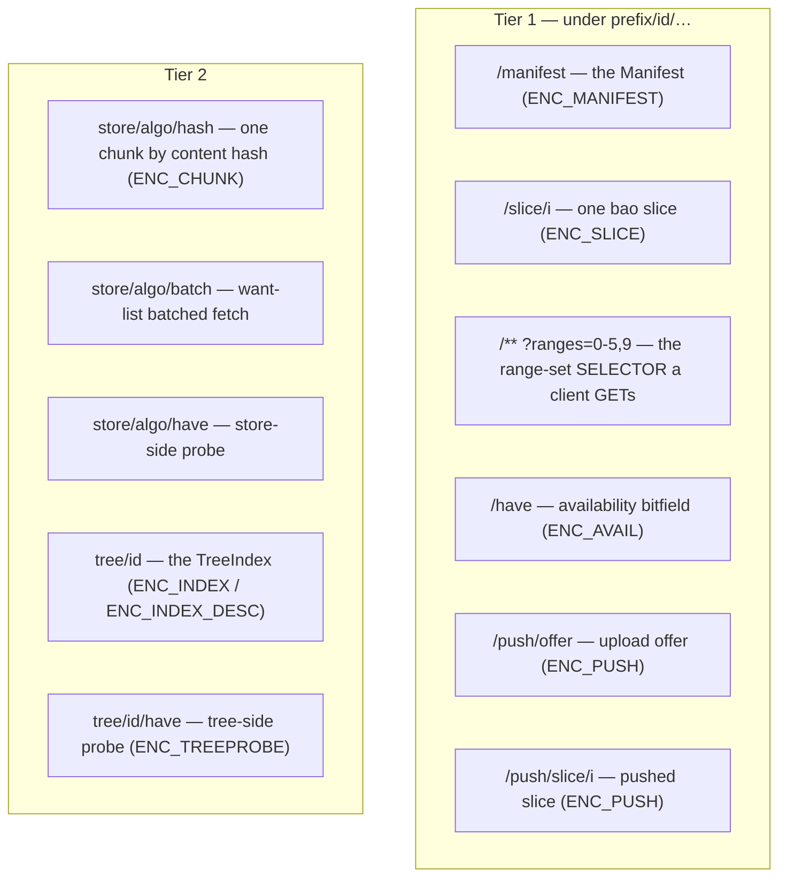

# The wire protocol and keyspace

How `zblob` addresses payloads on the Zenoh keyspace, frames control messages,
and versions the whole thing. Several of the rules here look like oversights
from outside; each is load-bearing, and this document says why.

## Keys are typed, and built in one place

Every key expression the crate speaks is built by a function in `zblob::keys`,
never with an ad-hoc `format!`. That is not a style rule. A slice reply whose
key does not match its query is **silently dropped** by Zenoh
(`ReplyKeyExpr::MatchingQuery`), so a hand-built key fails as a bare timeout
with nothing to debug. `slice_selector` exists to make that mistake impossible.

Prefixes are typed by the role they play (`prefix.rs`): a server owns a
concrete `ServePrefix`, a client asks through a `QueryPrefix` (which may name
several origins). Serving implies being able to ask, so the conversion one way
is free and the other is fallible — a server cannot be built on a wildcard
because there is no concrete value to build it from.

### The key layout



The exact builders: `manifest_key` → `<prefix>/<id>/manifest`, `slice_key` →
`<prefix>/<id>/slice/<i>`, `slice_selector` → `<prefix>/<id>/**?ranges=<spec>`,
`availability_key` → `<prefix>/<id>/have`, `push_offer_key` /
`push_slice_key` → `<prefix>/<id>/push/{offer,slice/<i>}`, `store_key` →
`<prefix>/<algo>/<hash>`, `store_batch_key` / `store_have_key` →
`<prefix>/<algo>/{batch,have}`, `tree_key` → `<prefix>/<id>`, `tree_have_key`
→ `<prefix>/<id>/have`. Parsers (`parse_id`, `parse_ranges`,
`parse_tier2_tail`) read them back and reject anything malformed.

## The wire is positional postcard, versioned first

There is exactly one wire encoding: **postcard** (compact varint framing).
v1's mistake was letting each peer pick JSON or CBOR, so a mismatch surfaced as
an opaque decode error deep in a transfer. Postcard is *positional* — nothing
on the wire names its fields — which has one sharp consequence:

> **Every control struct carries an explicit schema `version` as its first
> field, and any change to a struct's shape bumps `WIRE_VERSION`.** A reordered
> or inserted field with no bump is silent corruption: the decode succeeds and
> means something else.

`WIRE_VERSION` is currently **3**. On top of that, every reply tags its Zenoh
`Encoding` with a constant (`ENC_MANIFEST`, `ENC_SLICE = "zblob/bao4;v=3"`,
`ENC_CHUNK`, `ENC_PUSH`, `ENC_AVAIL`, `ENC_INDEX`, `ENC_FANOUT`, …). Receive
paths **filter on that tag before decoding**, so a foreign or stale peer is
diagnosable rather than producing garbage — and a receiver rejects a sample for
*what it is* instead of failing deep inside a transfer. (This rule is easy to
half-apply: the fanout receiver once filtered in its manifest phase but not its
slice phase, which a co-publisher could exploit — see
[design-decisions.md](design-decisions.md).)

## Two facts the query mechanics rely on

- **Backpressure is automatic.** `Session::get` defaults to
  `CongestionControl::Block` and replies inherit it, so chunk replies block
  rather than drop under load. The crate deliberately sets no congestion
  control on queries and does not enable Zenoh's `internal` feature. Reply
  *consolidation* is a separate knob: clients set `ConsolidationMode::None` so
  replies stream instead of buffering until the query finalizes. (Publications
  default to `Drop`, so the fanout tier sets `Block` explicitly.)
- **An unknown id costs no timeout.** A Zenoh query finalizes once its matching
  queryables complete, and completing *without replying* is immediate
  (measured ~1 ms against a 30 s timeout). So a server's way to say "not mine"
  is silence — no negative-reply message — and that is exactly what lets
  several servers share one prefix. See `an_unknown_id_fails_fast_not_on_the_timeout`.

## The wire-v3 traps

Wire v3 added batched tier-2 fetch, probes, and index sharding. Four things in
it look wrong from outside and are not; do not "simplify" them without
reading `tests/hostile_store.rs` and `docs/router-storage.md`.

```mermaid
sequenceDiagram
    participant C as TreeClient
    participant Sv as TreeServer
    participant St as router storage
    Note over C: GET the batch key with a want-list; accept_replies(ReplyKeyExpr::Any)
    C->>Sv: batched fetch (want-list)
    Note over Sv: replies come back on each chunk's OWN key, disjoint from the batch key
    Sv-->>C: chunks by their own keys
    Note over C: still missing after the round?
    C->>St: per-chunk fallback: GET each chunk by hash
    St-->>C: chunk (a storage answers by key, has nothing at /batch)
```

1. **Batched fetch replies on a disjoint key, so the query must set
   `accept_replies(ReplyKeyExpr::Any)`.** The want-list goes to
   `<store>/<algo>/batch`, but each chunk reply comes back on the chunk's *own*
   `<store>/<algo>/<hash>` key. Without `Any`, Zenoh refuses each reply *on the
   server*. And do not widen the request into `<store>/<algo>/**`: that would
   make every router-hosted storage in range dump its entire content store in
   answer to one query.
2. **A batch is not answered by storages, so the per-chunk fallback is not
   optional.** A router storage serves by key and has nothing at `…/batch`. The
   per-chunk GET after each round is what keeps the publish-then-exit tier
   working; dropping it breaks serverless fetch.
3. **Servers reply on their own key, not `query.key_expr()`.** Against a
   concrete GET they are identical; against a wildcard-origin query the query
   names *every* origin, so replying with it makes answers unattributable and
   uncacheable.
4. **Large indices only are sharded.** A small `TreeIndex` is served whole; a
   large one is sharded into the store and served as an `IndexDescriptor`
   (`ENC_INDEX_DESC`). An index costs ~0.05–0.10% of its payload, so a
   descriptor on *every* fetch would add a round trip for nothing. The
   thresholds are measured — see [design-decisions.md](design-decisions.md).

**Probes report a size that is a function of the question, never of the
objects** (`…/<algo>/have`, `<tree>/<id>/have`). That is the whole reason a
tier-2 probe is allowed to exist under the keyspace RFC: it leaks nothing about
what a holder has beyond the yes/no the caller already asked.

See [architecture.md](architecture.md) for how these keys fit the three tiers,
and [integrity-model.md](integrity-model.md) for what a slice on `slice/<i>`
actually carries.
